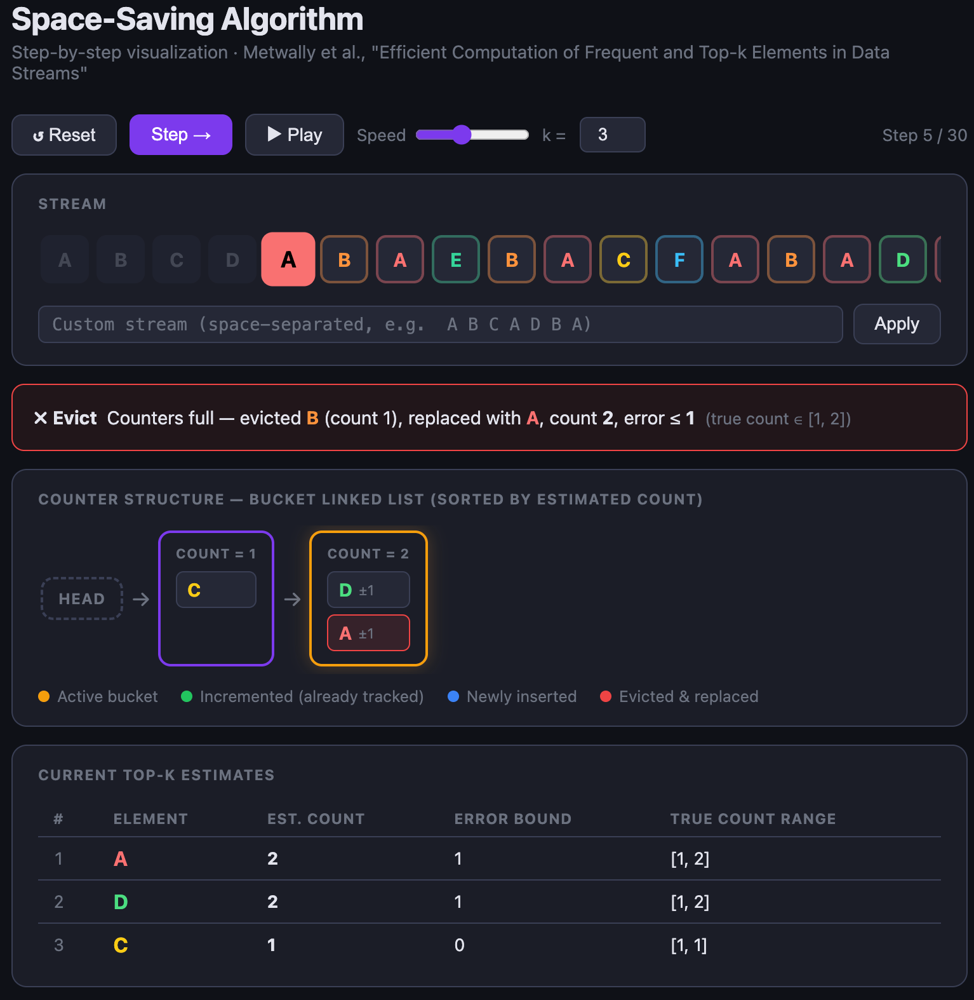

# Top-K Streamer

It's straightforward solve for top-k elements in a running data stream.  I was interested in extracting the top-k elements in a data stream for any time window, specifically top-k elements by sum (assuming high cardinality). 

To approach this, I implemented 2 algorithms: 
### 1. Space-Saving
**Reference:** https://www.cse.ust.hk/~raywong/comp5331/References/EfficientComputationOfFrequentAndTop-kElementsInDataStreams.pdf

(Assuming values in the stream have weight/count = 1) : Estimate the frequencies of elements by monitoring m elements at a time, incrementing an element's counter as it's observed in the stream. Using linked lists, each counter points to a parent bucket, and parent buckets are in sorted order; this offers $\Theta$(1) time retrieval.

#### To run the visualizer: ```open visualization.html```



https://dimacs.rutgers.edu/~graham/pubs/papers/freq.pdf
https://www.cs.uml.edu/~ge/pdf/icde17_topkFreq.pdf

### 2. Dyadic Space Saving
For arbitrary time windows, the choice of algorithm depends on whether we need exact or approximate top-k by sum.

Since we assume high cardinality (large N), we prefer an approach with space independent of N. We decompose time into a binary merge tree of epochs: as each epoch completes, it merges with its neighbor to form a higher-level epoch, and old epochs are discarded. At any point, only O(log W) epochs are live (where W is the time horizon). Each epoch holds a Space-Saving sketch of size k, so total space is **O(k log W)**, determined only by how many results we want and how far back we query, not by how many distinct elements flow through the stream. Any window [t1, t2] decomposes into O(log W) epochs; we merge those sketches and extract the top-k. This takes O(k log W) space (but provides an approximation for top-k by sum)

Note: I also considered implementing the Threshold Algorithm, which provides exact top-k elements in the min number of accesses for any correct algorithm. The space for preprocessing the intervals and running TA would have been O(NlogW). 

### 3. Systems Approach
For real-time streaming and results, we would probably want to use Kafka for stream ingestion and ClickHouse (offers robust support for time windows)